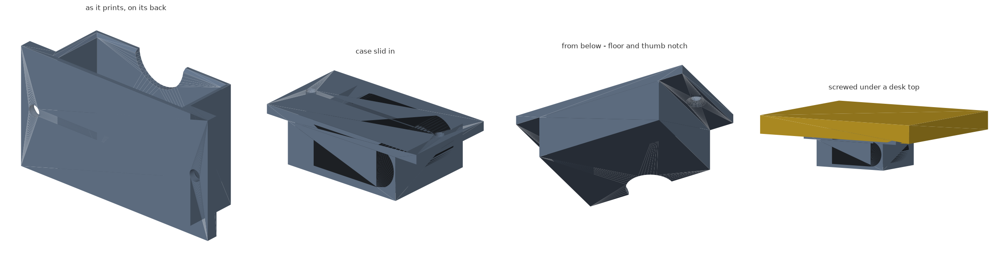

# Under-desk AirPods Pro case tray

A shallow open-front tray that screws to the underside of a desk. The case lies
flat, big face to the desk, and slides in and out from the front. A thumb notch
in the floor lets you push it back out.



## Dimensions

| | mm |
| --- | --- |
| Overall, including mounting pads | 92.8 x 50.7 x 28 |
| Pocket | 61.8 wide x 46.2 deep x 22.5 |
| Drop below the desk | 28 |
| Screw centres | 79.8 apart |
| Material | 33 cm3 (~21 g) |

Clearance is 0.6 mm each side, 0.8 mm above and 1 mm front-to-back.

## The case, and what is knowable about it

Apple publishes the AirPods Pro 2 charging case as **45.2 x 60.6 x 21.7 mm**,
50.8 g. It does not publish the radii, and neither does anyone else.

Lying flat, that barely matters - a square pocket takes the case whatever its
corners do. It shows up in exactly one place. The case's cross-section is a
stadium: 60.6 wide, 21.7 thick, ends fully rounded. So the face it lies on is
only flat across its middle **38.9 mm** - the rest curves away. That is why the
tray has a **solid floor** rather than a pair of shelves at the edges: shelves
would meet the case on the curve, on two lines, and let it rock. The check
measures that the floor really is solid under that 38.9 mm.

## Why flat rather than on end

Stood on end the case has to be held up against gravity, which needs a snap,
and a socket that shallow has no wall length to spring with - a 14 mm wall is
some 30 N/mm, so a 1 mm catch would take more force to fit than the case can
survive. Lying flat, the floor does the work and there is nothing to latch.

## Printing

Print `airpods-holder.stl` as it comes - it is exported on its back face, which
is how it prints. Everything is walls running along the build direction; the
only thing left facing down is the top of each screw bore, a 5 mm hole printed
on its side. 22 mm2 of the part, and nothing anywhere else.

| | |
| --- | --- |
| Bed footprint | 92.8 x 28 mm, 50.7 mm tall |
| Supports | none |
| Material | PLA or PETG |
| Layer height | 0.2 mm |
| Walls | 3 perimeters |
| Infill | 20% |

## Mounting

Two **#8 or M4 flat-head wood screws** on a 79.8 mm pattern, countersunk flush
into the side pads. Pilot 2.5-3 mm; screws no longer than
`5 mm + desk thickness - 3 mm`. The pads are outboard so a driver reaches the
screws from below without going into the tray.

## Files

| file | what it is |
| --- | --- |
| `under_desk_airpods_holder.scad` | the model - every dimension is a parameter |
| `airpods-holder.stl` | ready to slice |
| `build.sh` | render, verify, re-render the preview |
| `verify.py` | checks the exported STL against the fit and print rules |
| `render_previews.py` | regenerates `preview.png` |

## Changing it

Edit the parameter block and run `./build.sh`.

```
mesh        one watertight solid, on z = 0 on its back, 92.8 x 28.0 x 50.7 mm
slide       slides the whole way in and out, 0.8 mm clear, far end closed
support     floor solid under the case's flat 38.9 mm middle, notch open
fasteners   2 holes bored through, pads solid, driver reaches both heads
print       the screw bores are the only overhang
```

## Notes and limits

- Sized for the **2nd gen / USB-C** case. The 1st gen Pro case is the same
  size. The standard AirPods case is a different shape and will not fit.
- With the case in a silicone skin, add the skin's thickness to `GAP_SIDE` and
  `GAP_TOP`.
- Nothing latches it. The tray is horizontal, so gravity is not trying to pull
  the case out - only a knock from the front would, and the case is 50 g.
