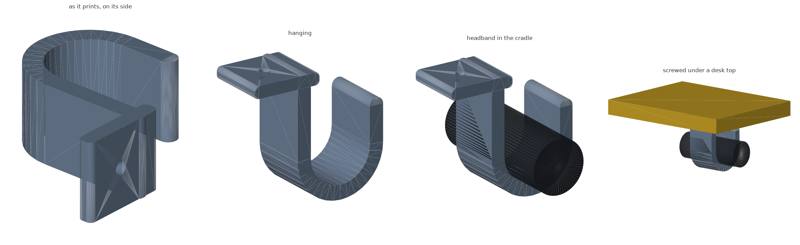

# Under-desk headphone hook

A J that screws to the underside of a desk and hangs headphones off it. One
screw, through a pad that beds flat against the desk.



## Dimensions

| | mm |
| --- | --- |
| Overall | 63 x 67.5 x 30 |
| Hangs below the desk | 62 |
| Throat, clear between arm and tip | 31 |
| Cradle width | 30 |
| Tip rise above the cradle floor | 34 |
| Material | 30 cm3 (~19 g) |

## Sizing

A padded over-ear headband runs 20-30 mm thick and 30-45 mm wide, and the
headphones themselves 250-400 g. Two things follow:

- **The throat has to swallow the thick part**, not just the strap. What
  matters is the gap left *after* the bar - a 38 mm centreline throat on a
  7 mm bar leaves 31 mm clear, which takes a 28 mm band with room. The first
  cut of this had a 32 mm throat, which leaves 25 mm, and the check caught
  that a fat band would not go in.
- **The cradle wants to be wide.** At 30 mm across, with every edge radiused,
  it spreads the band instead of creasing it.

The arm carries 4 N at about 50 mm, which is under 1 MPa at the root - nowhere
near anything. The hook is sized by what fits, not by what it can hold.

## Printing

Print `headphone-hook.stl` as it comes - it is exported lying on its side,
which is how it prints. The whole part is one profile swept across its width,
so **nothing overhangs but the screw bore**, and the layers run along the arm
rather than across it, which is the direction the load pulls.

| | |
| --- | --- |
| Bed footprint | 63 x 67.5 mm, 30 mm tall |
| Supports | none |
| Material | PETG or PLA |
| Layer height | 0.2 mm |
| Walls | 3 perimeters |
| Infill | 25% |

## Mounting

One **#8 or M4 flat-head wood screw**, 20-25 mm.

1. Hold the pad against the desk, mark through the hole, pilot 2.5-3 mm.
2. Drive it home. The screw sits 15 mm back from the arm so a driver clears it.

Screw no longer than `6 mm + desk thickness - 3 mm`. One screw is enough: the
load hangs almost straight down, so it is the pad bearing on the desk that
takes it, not the screw resisting a twist.

## Files

| file | what it is |
| --- | --- |
| `under_desk_headphone_hook.scad` | the model - every dimension is a parameter |
| `headphone-hook.stl` | ready to slice |
| `build.sh` | render, verify, re-render the preview |
| `verify.py` | checks the exported STL |
| `render_previews.py` | regenerates `preview.png` |

## Changing it

Edit the parameter block and run `./build.sh`.

```
mesh        one watertight solid, on z = 0 on its side, 63 x 67.5 x 30 mm
headband    a 28 mm band sits in the cradle, 31 mm clear throat, 34 mm tip rise
fastener    hole bored through, pad solid around it, driver clears the arm
print       only the screw bore overhangs
```

`THROAT` is the one to change for bigger headphones - the assert makes sure it
still leaves 30 mm clear after the bar. `WIDTH` widens the cradle. The check
that the pad "is actually there" is not padding: `PAD_R` was briefly larger
than half the pad's thickness, which made the rounded rectangle come out empty
and the pad vanish from the model without any error at all.
