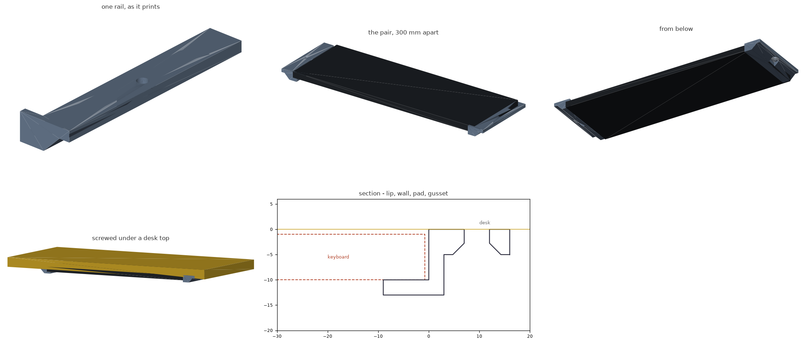

# Under-desk keyboard rails

A pair of channels that screw to the underside of a desk. The keyboard slides
in from the front and hangs out of the way. One screw per rail - you set the
spacing when you mark the holes, so the same part fits any width of keyboard.



Built for a keyboard **9 mm** high and **103 mm** deep. Print the model once as
it stands and once with `MIRROR=true`; both STLs are here.

## Dimensions

| | mm |
| --- | --- |
| Each rail (W x L x H) | 25 x 100 x 13 |
| Channel | 10 high, 9 deep - a 9 mm keyboard with 1 mm over it |
| Drop below the desk | 13 |
| Material | 16 cm3 each (~12 g), about 40 minutes a rail |

## Spacing

Everything is measured off the rail's inner wall face - the one the keyboard's
edge runs against.

| | |
| --- | --- |
| Wall faces apart | keyboard width **+ 1.5 mm** |
| Screw centres apart | keyboard width **+ 20.5 mm** |

So for a 300 mm keyboard: holes 320.5 mm apart. Measure your keyboard at its
widest, including any moulding on the case.

## How it holds

- **Lip** - 9 mm of flat ledge under each edge of the keyboard, square into the
  corner so the keyboard's side sits flat against the wall rather than riding
  up on a fillet.
- **Rear stop** - 3 mm at the back of each rail, so the keyboard lands in the
  same place every time. The rail is 100 mm long against a 103 mm keyboard, so
  about 6 mm sticks out at the front to grab.
- **Lead-in** - the last 8 mm of the ledge ramps down 1.5 mm, so the keyboard
  finds the channel when you push it in without looking.
- **One screw** - a #8 or M4 flat head, countersunk flush into a 13 x 100 mm
  pad. A single screw can in principle let the rail pivot, but the friction a
  hand-tight screw puts on a pad that size beats the twist that sliding a
  keyboard in applies by an order of magnitude. Tighten it properly and it
  will not move.

## Printing

Print `keyboard-rail-right.stl` and `keyboard-rail-left.stl` as they come -
they are exported sitting on z = 0, the same way up as they hang. No supports.

| | |
| --- | --- |
| Bed footprint | 25 x 100 mm each, 13 mm tall |
| Supports | none |
| Material | PLA is fine here; PETG if the desk gets sun |
| Layer height | 0.2 mm |
| Walls | 3 perimeters |
| Infill | 25% |

The only overhang in the part is a 5 mm strip of the pad's underside past the
gusset, plus the 15 mm the pad bridges where the gusset steps aside for the
screw head. Both print unsupported, and neither is a surface you see or use.
The keyboard's rest face and the wall come out clean because the rail prints
the right way up.

## Files

| file | what it is |
| --- | --- |
| `under_desk_keyboard_rail.scad` | the model - every dimension is a parameter |
| `keyboard-rail-right.stl` | ready to slice |
| `keyboard-rail-left.stl` | the same, mirrored |
| `build.sh` | render both, then verify and re-render the preview |
| `verify.py` | checks the exported STLs against the fit and print rules |
| `render_previews.py` | regenerates `preview.png` |

## Changing it

Edit the parameter block and run `./build.sh`. `KB_H` and `GAP_H` set the
channel; `LIP_IN` how far the ledge reaches under the keyboard; `RAIL_L` the
length. Set `SHOW_KB = true` to see the keyboard ghosted in place in the
OpenSCAD GUI.

`verify.py` reads the parameters back out of the `.scad` and checks the meshes
against them:

```
mesh        both rails watertight and single solids, true mirror images
print       exported on z = 0 the way they hang, 25 x 100 x 13 mm
fit         keyboard slides the length of the channel, 9 mm of flat ledge
stop        rear stop blocks it
fastener    hole bored through, pad solid around it, driver reaches the head
support     the pad underside is the only overhang in the part
```

The fit check is the one that earns its keep: the first cut of this rail had a
45 degree fillet in the channel corner, which prints beautifully and sits
exactly where the keyboard's bottom edge needs to be. The check caught it, and
the fix - turning the part the right way up and carrying the pad on a gusset
instead - is a better part.

## Notes and limits

- Sized off a keyboard that is 9 mm at its thickest. Plenty of keyboards are
  wedge-shaped: measure the back, not the front, and put that in `KB_H`.
- The rails hold the keyboard by its edges, so a case with a lip, a rubber
  skirt or a sharply rounded underside may not sit on 9 mm of ledge. Raise
  `LIP_IN` if you want more bite.
- There is no latch. The keyboard rests on the lips and slides out when you
  pull it, which is the point - it is a tray, not a mount.
- The screw is 6.5 mm out from a wall that hangs 13 mm down, so a normal
  screwdriver or a driver bit clears it easily.
