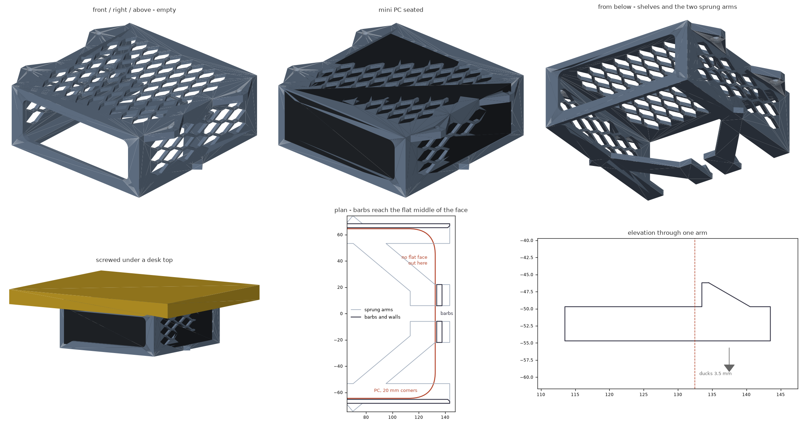

# Under-desk mini PC mount

A printable cradle that screws to the underside of a desk. The mini PC slides
straight in from the front, sits on two shelves, and clicks in behind a pair of
sprung arms. No brackets, no straps, no fasteners into the PC itself.



Built for a **129 x 129 x 45.5 mm** mini PC. Any other size is a three-number
edit at the top of the `.scad` file.

## Dimensions

| | mm |
| --- | --- |
| Pocket (W x D x H) | 130.6 x 130 x 46.7 |
| Body (W x D x H) | 136.6 x 143.5 x 54.7 |
| Overall, including mounting pads | 164.6 x 143.5 x 54.7 |
| Drop below the desk | 54.7 |
| Screw pattern | 151 across x 83.5 along |
| Material | 111 cm3 solid (~100 g as printed) |

Clearance is 0.8 mm each side, 1.2 mm above and 1 mm front-to-back - snug, but
with enough left that a print coming out a few tenths tight still takes the
device.

## How it holds the PC

- **Bottom shelves** - two 12 mm lips carry the weight; the middle of the
  underside is open, so the intake fan is not covered.
- **Rear wall** - depth stop, with a 113 x 37 mm cutout so the rear ports and
  cables stay accessible.
- **Latches** - two sprung arms sweep in from the shelves to the middle of the
  mouth and stand a 3.5 mm barb in front of the PC. They reach that far in on
  purpose: on a machine with rounded corners there is no flat front face out
  near the walls - with a 20 mm radius the face is already 7 mm back at
  x = 60 - so a barb there catches nothing. At x = 6-22 the face is flat for
  any corner radius up to 42 mm. The PC's underside presses each arm down over
  a 30 degree ramp on the way in and they spring back behind the front face
  with a click - 0.8 to 1.8 kgf for the pair, depending on how much the shelf
  root gives. The face behind the barb is **square**: there is no angle for the
  PC to cam its way up, so pressing buttons or tugging a cable cannot walk it
  out. To release, press both arms down through the open underside and pull.
  The arms sit flush with the pocket floor, so they also carry the middle of
  the PC.
- **Airflow** - open bottom, open front, a 113 x 37 mm rear cutout, and a
  12 x 26 mm vent lattice through the top plate and both side walls: 66 cells
  overhead (~8,500 mm2 open) and 18 per side (~2,300 mm2 each).

## Printing

Print `under-desk-minipc-mount-print.stl`. It is the same solid rolled onto
its back face, which is what makes the part support-free: every wall runs
along the build direction, and the vent cells are hexagons stretched to a
point at each end, the points along that direction. A cell closes at 60
degrees from horizontal rather than bridging flat across its width, so the
lattice needs no bridging at all, and the arms sweep in at 40 degrees, under
the angle where a leaning wall needs help. What is left is 0.3% of the
surface: the four horizontal screw bores, and the 16 x 3.5 mm face behind each
barb. That face is the dead stop, so it is square to the way the PC travels,
which is the build direction - it prints as a flat roof and will sag a little
on the first layer across it. The sag leans back into the 1 mm of front-to-back
slack, so it costs nothing; if you would rather have it crisp, drop
`BARB_HOOK` to about 75, at the cost of a face the PC can cam against.

| | |
| --- | --- |
| Bed footprint | 165 x 54.5 mm, 142 mm tall |
| Supports | none |
| Material | PETG or ASA (a mini PC exhausts warm air; PLA softens) |
| Layer height | 0.2 mm |
| Walls | 4 perimeters |
| Infill | 25%, gyroid or grid |

`under-desk-minipc-mount.stl` is the same part in its as-designed orientation
(desk surface at the top) if you would rather rotate it yourself.

## Mounting

Four **#8 or M4 flat-head wood screws**. The 5 mm clearance holes leave room to
shuffle the mount a little if a pilot hole wanders. The pads are 6.5 mm thick
with 90 degree countersinks, so the heads finish flush. Nothing crowds them, but they
sit 7 mm out from a wall that hangs 54.5 mm down, so use a hand screwdriver or
a bit extension rather than a drill chuck.

1. Hold the mount against the underside of the desk and mark the four holes.
2. Pilot drill 2.5-3 mm, **no deeper than the desk is thick minus 3 mm**.
3. Pick screws no longer than `6.5 mm + desk thickness - 3 mm` - on an 18 mm
   desk top that is a 20 mm screw at most.
4. Drive all four, then slide the PC in until the arms click.

To take the PC out, reach under the open bottom, press both arms down near the
mouth, and pull. Pulling without pressing will not do it, which is the point.

Solid wood, plywood and particle board all take screws fine. On a glass or
metal desk, the pads are flat and take 20 mm wide VHB tape instead.

## Files

| file | what it is |
| --- | --- |
| `under_desk_minipc_mount.scad` | the model - every dimension is a parameter |
| `under-desk-minipc-mount-print.stl` | ready to slice, back face on the bed |
| `under-desk-minipc-mount.stl` | as-designed orientation |
| `build.sh` | render both STLs, then verify and re-render the preview |
| `verify.py` | checks the exported STL against the fit and print rules |
| `render_previews.py` | regenerates `preview.png` from the STL |

## Changing it

Edit the parameter block in the `.scad` and run `./build.sh` (needs
`openscad`, plus `trimesh`, `numpy`, `manifold3d`, `scipy` and `matplotlib`
for the checks and preview). Set `SHOW_PC = true` to see the device ghosted in
place while you work in the OpenSCAD GUI.

`verify.py` is the useful part of that loop. It reads the parameters back out
of the `.scad` and checks the exported mesh against them:

```
mesh        watertight, one connected solid, consistent winding
envelope    164.6 x 143.5 x 54.7 mm
fit         seated PC clears the frame, 1.20 mm of headroom
insertion   slide-in path is clear apart from the barbs
latches     barbs stand 3.5 mm proud at x 6-22 mm, 112 mm2 of catch, air to duck
retention   0.9 mm slide-out is free travel, 1.5 mm is stopped
vents       66 top cells, 18 per side wall, 4 screws, 1 port = 107 holes
fasteners   4 bored through, pad solid around each, driver reaches every head
print       sits on z = 0, largest unsupported patch 56 mm2 (a barb face)
```

So if you retune the fit for a different device, it will tell you whether the
PC still goes in, still stays in, and still prints without supports. The vent
check counts the through-holes in the mesh against the cell count the
parameters imply, which is what catches a vent field that quietly came
out empty rather than just a heavier part.

`ARM_X` is the one to watch: it sets how far in from the centre line each barb
lands, and `verify.py` reports the largest corner radius that still leaves flat
face under it. `ARM_W` and `ARM_T` set the click - the arm is a cantilever, so
force goes as thickness cubed and falls off as length cubed. At 16 x 5 mm it
sees 5-9 MPa at the root, well under what PETG manages across layer lines,
which is the number that matters because the arm prints along the build
direction; 12 x 4 was 2.6 times softer. `BARB_H` is how far it stands proud, and `BARB_HOOK` how steeply it
refuses to come back out; at 90 it is a dead stop.

`VENT_W`, `VENT_LEN` and `VENT_RIB` set the cell size and the web between
cells, and `VENT_ANGLE` sets how steeply each cell closes - drop it towards 45
for rounder cells, raise it for more margin over the overhang limit. The rows
interlock the way a honeycomb does, which holds for any cell proportion, and
each cell is the tile shrunk by half a rib, so the web comes out even
everywhere including at the points. `TOP_VENT_BORDER`, `SIDE_VENT_BORDER` and
`SIDE_VENT_MARGIN` set the solid margins around each field; cells that would
hang over a border are dropped whole, so the edges never end in slivers.

## Notes and limits

- The pocket is a slip fit, not a clamp. The PC rests on the shelves and the
  arms under its own weight, and the barbs stop it sliding forward. Mount it under a
  horizontal surface, not on a wall.
- The barbs catch the bottom 3.5 mm of the PC's front face, in from the centre
  line. A machine with a deep radius or a soft foot along its bottom front edge
  has less flat face down there to bite on - raise `BARB_H` for more, at the
  cost of a slightly longer unsupported ledge on the print.
- The top plate beds directly against the desk, so the 2 mm above the PC is a
  dead gap, not a cooling path. Heat leaves through the open bottom, front,
  rear cutout and side vents.
- The top plate is a third of the material and does no structural work beyond
  tying the two side walls together and keeping the desk off the PC. Dropping
  it (`TOP_T` down to nothing) would save another ~33 cm3, at the cost of
  the top grid and a floppier mouth until the mount is screwed down.
- Sized for a device up to about 2 kg. Beyond that, add a value to `SCREW_YS`
  for a third pair of pads and go to 6 perimeters (`verify.py` expects four
  screws, so bump that too).
- The rear cutout assumes ports across the back panel. If yours are on a side,
  turn the PC around and let the cables come out of the open front instead.
