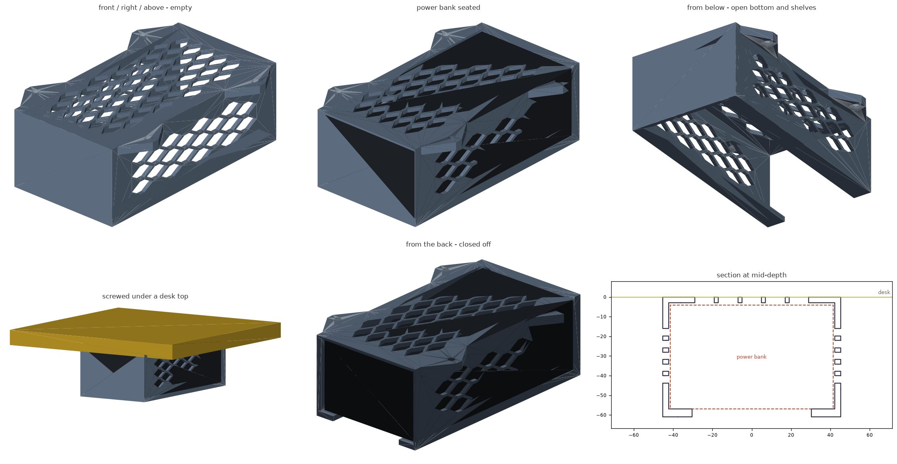

# Under-desk power bank tray

A printable cradle that screws to the underside of a desk. The power bank
slides in end-on from the front and lies flat on two shelves. Nothing latches
it: it is a heavy brick in a horizontal tray, so it goes in and out from the
front and that is the whole interaction. The far end is closed off.



Built for an **83 x 165 x 52.7 mm** power bank, lying flat with its 52.7 x 83
end facing the front of the desk - so the ports and display face out of the
open mouth where you can reach them, and the long axis runs back under the desk.

This is the [mini PC mount](../under-desk-minipc-mount/) re-parameterised: same
tray, same shelves, same checks. What changed is below.

## Dimensions

| | mm |
| --- | --- |
| Pocket (W x D x H) | 84.6 x 166 x 53.9 |
| Body (W x D x H) | 90.6 x 172.5 x 60.9 |
| Overall, including mounting pads | 118.6 x 172.5 x 60.9 |
| Drop below the desk | 60.9 |
| Screw pattern | 104.6 across x 112.5 along |
| Material | 113 cm3 solid (~100 g as printed) |

Clearance is 0.8 mm each side, 1.2 mm above and 1 mm front-to-back.

## What changed from the mini PC mount

- **No latch.** The sprung arms and barbs are gone. A 600-900 g brick lying in
  a horizontal tray is not going anywhere on its own, and you asked for a pure
  slide in and out - so the check that used to prove the barbs stopped it now
  proves the opposite: the whole travel, in and out, is clear.
- **The far end is closed.** No rear cutout at all. Your ports face forward out
  of the mouth, so the back does not need to open for anything, and a solid
  back wall is a better first layer too.
- **Front lip 10 -> 3 mm.** It only existed to carry the barbs; now it is just
  a margin for the lead-in chamfer. That is 7 mm off the depth.

Everything else - the honeycomb vents, the mounting pads, the shelves, the
print orientation - is unchanged, and the vent fields resized themselves from
the new box.

## Airflow

A power bank pushing 100 W gets warm, and the closed back means it breathes
through the sides and the mouth. Open bottom, open front, and the vent lattice
through the top plate and both side walls: 49 cells overhead (~6,300 mm2 open)
and 20 per side (~2,600 mm2 each). If yours runs hot, the back wall is the
place to put an opening back - it costs nothing structurally.

## Printing

Print `under-desk-powerbank-tray-print.stl` - the same solid rolled onto its
back face, which is what makes it support-free.

| | |
| --- | --- |
| Bed footprint | 118.6 x 60.9 mm, 172.5 mm tall |
| Supports | none |
| Material | PETG or ASA - a power bank under load runs warm |
| Layer height | 0.2 mm |
| Walls | 4 perimeters |
| Infill | 25% |

172.5 mm is a tall print. It is stable on a 118.6 x 60.9 footprint, but if your
printer is fussy about height, this is the part to add a brim to.

## Mounting

Four **#8 or M4 flat-head wood screws**, on a 104.6 x 112.5 mm pattern. Same as
the mini PC mount: pilot 2.5-3 mm, screws no longer than
`6.5 mm + desk thickness - 3 mm`, and use a hand screwdriver or a bit extension
rather than a drill chuck - the screws sit 7 mm out from a wall that hangs
60.9 mm down.

Slide the bank in from the front until it meets the back wall. Pull it out the
same way.

## Files

| file | what it is |
| --- | --- |
| `under_desk_powerbank_tray.scad` | the model - every dimension is a parameter |
| `under-desk-powerbank-tray-print.stl` | ready to slice, back face on the bed |
| `under-desk-powerbank-tray.stl` | as-designed orientation |
| `build.sh` | render both STLs, then verify and re-render the preview |
| `verify.py` | checks the exported STL against the fit and print rules |
| `render_previews.py` | regenerates `preview.png` |

## Changing it

Edit the parameter block and run `./build.sh`.

```
mesh        watertight, one connected solid, consistent winding
envelope    118.6 x 172.5 x 60.9 mm
fit         seated bank clears the frame, 1.20 mm of headroom
slide       slides the whole way in and out, far end closed, 24 mm of shelf
vents       49 top cells, 20 per side wall, 4 screws, closed back = 93 holes
fasteners   4 bored through, pad solid around each, driver reaches every head
print       sits on z = 0, largest unsupported patch 17 mm2 (a screw bore)
```

## Notes and limits

- A 25,000 mAh brick this size runs 600-900 g. The tray is fine with that - it
  was sized for a 2 kg device - but do drive all four screws into something
  solid, not into a 6 mm drawer bottom.
- Give it air. A bank charging at full tilt under a desk with no airflow will
  throttle; the vents help, but with the back closed there is less through-flow
  than there was, so do not box it in further.
- Nothing stops it sliding out but its own weight and the friction of the
  shelves. That is deliberate. If you ever want a stop, the mini PC mount's
  sprung arms drop straight back in - they are the same tray.
- If your bank is wedge-shaped or has a rubber foot strip, measure its thickest
  point for `BANK_H`.
