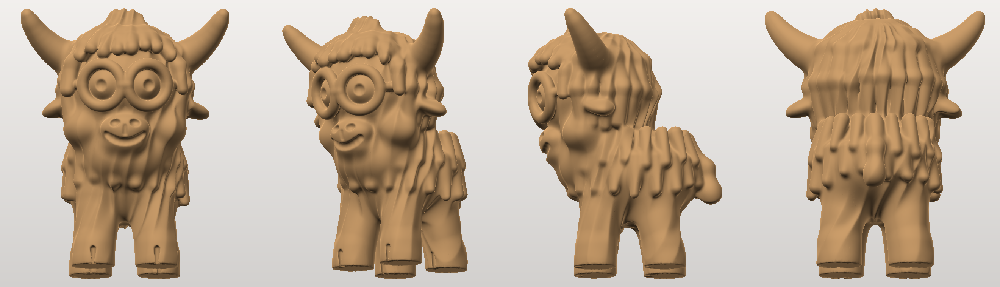
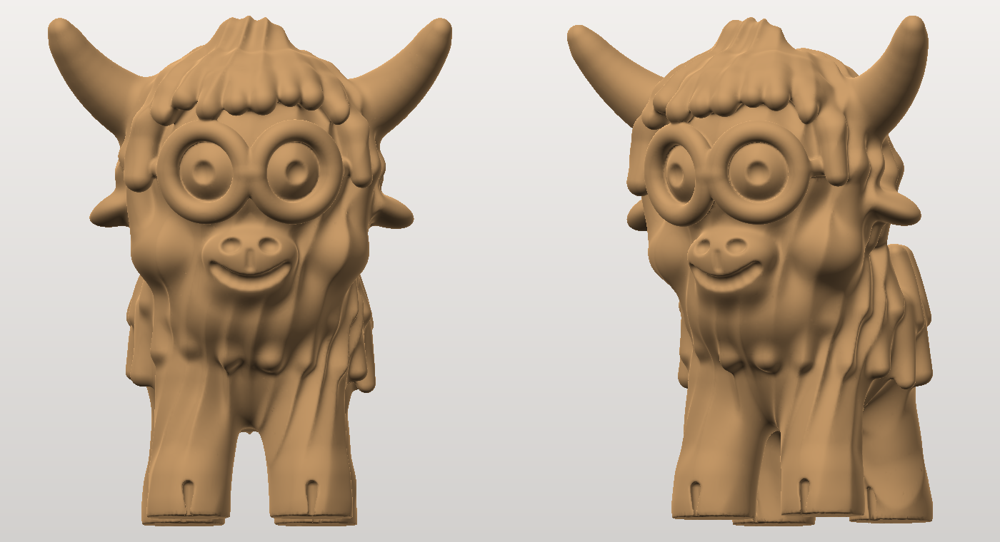

# Highland cow with spectacles — 110 mm 3D print

A chunky, bespectacled highland coo, generated procedurally as a signed-distance
field and meshed with marching cubes. The print-ready file is
**`highland_cow_110mm.stl`**.





## The print

| | |
|---|---|
| Size | 88.7 W × 84.2 D × **110.0 H** mm (width includes the horns) |
| Orientation | already upright, hooves flat on Z = 0, centred in X/Y |
| Mesh | binary STL, millimetres, 220 000 triangles |
| Solidity | watertight, manifold, single body, outward normals |
| Material | ~73 g of PLA at 3 walls / 15 % infill (198 cm³ solid) |
| Balance | centre of mass sits well inside the hoof footprint — it stands unaided |

Suggested settings — 0.16–0.20 mm layers (0.12 mm if you want the pupils and fur
crisper), 3 perimeters, 15 % infill, no ironing.

### Supports

About 9 % of the surface is steeper than a 45° overhang, so print it with
supports — tree supports touching the build plate only is plenty:

* **the belly and inner legs** (5 % of the surface) — the largest area, and the
  one that actually matters;
* **under the chin and snout**;
* **under the horns and ears** — the horns leave the head at about 20° above
  horizontal, which is the deliberate highland sweep;
* the **spectacles need no support at all** — the rims are fused to the head
  around their whole circumference, and the temple arms lie along the fur.

Nothing in the model is thin: the frames are 4.8 mm thick, the temple arms
3.7 mm, the horn tips 5.0 mm across, and each hoof puts a 13 mm circle on the
bed. It resin-prints as-is too.

## Regenerating or resizing

```bash
pip install numpy scikit-image trimesh fast-simplification pillow
python3 generate.py --voxel 0.35 --decimate 220000 --out highland_cow_110mm.stl
python3 render.py highland_cow_110mm.stl preview.png     # software-rendered views
```

| Flag | Meaning |
|---|---|
| `--height 150` | any other size; the model is rescaled so the cow is exactly this tall |
| `--voxel 0.25` | finer sampling (slower, bigger file); 0.9 is a fast draft |
| `--base` | adds a 3 mm rounded plinth under the hooves for bed adhesion |
| `--decimate N` | target triangle count; omit to keep the full marching-cubes mesh |

Generation takes about two minutes at 0.35 mm and reports the checks that
matter — watertightness, body count, wall thicknesses, filament, and whether the
centre of mass falls inside the footprint. It exits non-zero if any of those
fail, so you will know before you slice.

## How it is built

* `sdf.py` — distance-field primitives (sphere, ellipsoid, tapered capsule,
  rounded box, torus, and a ring-on-a-sphere used for the lenses) plus the
  smooth-union operators that give everything its soft, blobby joins.
* `cow.py` — the cow itself. All the proportions are constants at the top; the
  parts are sorted into four groups: `body` blobs blended broadly, fur `locks`
  blended tightly so they keep their edges, `smooth` parts (snout, horns, hooves,
  eyes) kept out of the fur displacement, `glass` for the spectacles, and `cut`
  for the carved nostrils, mouth and pupils. A sine-based groove field breaks the
  coat into wavy locks, faded out under the frames so rim and head fuse solidly.
* `generate.py` — samples the field in slabs, runs marching cubes, drops stray
  shells, decimates, rescales, and reports the printability checks.
* `render.py` — a small numpy z-buffer rasteriser, so previews need no GPU.

To restyle it, the constants block in `cow.py` is the place to start: `HEAD_R`
versus `BODY_R` sets how chibi it looks, `GLASS_*` moves and resizes the
spectacles, and `FUR_AMP` / `FUR_N` control the shagginess.
