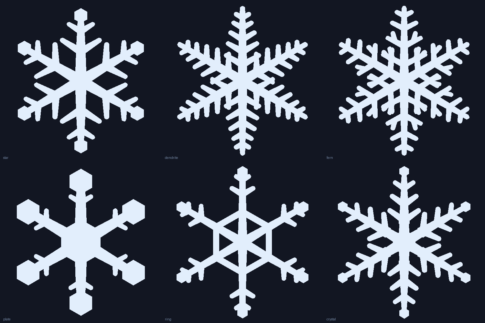
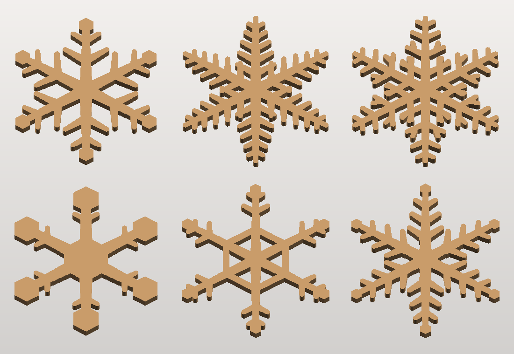

# Little snowflakes

Six six-fold snowflakes as flat extrusions — 45 mm across, 2.5 mm thick, flat
backs for gluing onto hair clips.





## The files

`snowflake_star_45mm.stl`, `_dendrite_`, `_fern_`, `_plate_`, `_ring_`,
`_crystal_` — one each, 1.5–2.0 g of filament apiece.

`snowflakes_all_45mm.stl` — all six laid out on a 135 × 100 mm plate, to print
the set in one go.

## Printing

Flat on the bed as exported. No supports, no overhangs — 0.2 mm layers, and the
whole set takes well under an hour.

* **Use a brim.** The branches are slim and there are a lot of separate starts on
  the first layer; a 3–5 mm brim stops any of them lifting.
* The bed side comes out flat and glossy — that is the face to glue to the clip.
* Every wall is at least **1.4 mm** (three or four passes of a 0.4 mm nozzle) and
  every gap at least **0.8 mm**, so nothing is too fine to resolve or so tight it
  fuses shut.

## Other sizes

```bash
python3 flakes.py --size 38 --thickness 2.2
```

Bar widths are fixed in millimetres rather than scaled, so a smaller flake never
drops below what the nozzle can lay down — it just comes out chunkier. What does
give way at small sizes is the *gaps* between branches:

| | 30 mm | 35 mm | 40 mm and up |
|---|---|---|---|
| star, plate, ring, crystal | fine | fine | fine |
| dendrite, fern | slots fuse | slots fuse | fine |

So the full set is good down to 40 mm; below that stick to the other four. The
script measures this on every run and fails rather than handing you a design
that would print as a blob.

## How they are drawn

Every element is a **bar**: the convex hull of two circles, which is a tapered
stroke with a rounded cap at each end. Unioning bars can only ever *add*
material, so the narrowest bar a design asks for is a hard floor on its feature
size — printability is a property of the drawing, not something to discover
afterwards. One arm is drawn pointing up, mirrored, and stepped round six times;
a hub, hex plates and hex rings go on top.

A design is a few lines of numbers in `FLAKES` — `t` values are fractions along
the arm, widths are millimetres:

```python
"star": {
    "hub": ("hex", 0.171, math.pi / 6),
    "shaft": [(0.0, 0.90, 3.6, 1.8)],          # t0, t1, width0, width1
    "branches": [(0.40, 58, 0.30, 2.4, 1.5),   # t, angle, length, w0, w1
                 (0.68, 58, 0.19, 2.0, 1.4)],
    "plates": [(0.90, 0.103)],                 # t, hexagon radius
},
```

Each run reports, per design: overall size, triangle count, weight, the
narrowest wall, the area sitting in sub-0.8 mm gaps, whether the outline is a
single connected piece, and whether the mesh came out watertight. It exits
non-zero if any of those fail.

One wrinkle worth recording: unioning dozens of rounded bars leaves near-duplicate
points in the outline, and the ear-clipping triangulator quietly leaves slivers
unfilled when it meets them — the extrusion then comes out with holes in it and
reports as non-watertight. Snapping the polygon to a micron grid
(`shapely.set_precision`) before extruding fixes it.

Renders above were made with the previewer from the sibling `highland-cow/`
project: `python3 ../highland-cow/render.py file.stl out.png --flat`.
