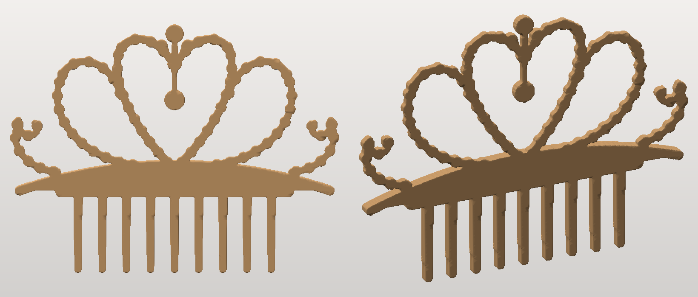
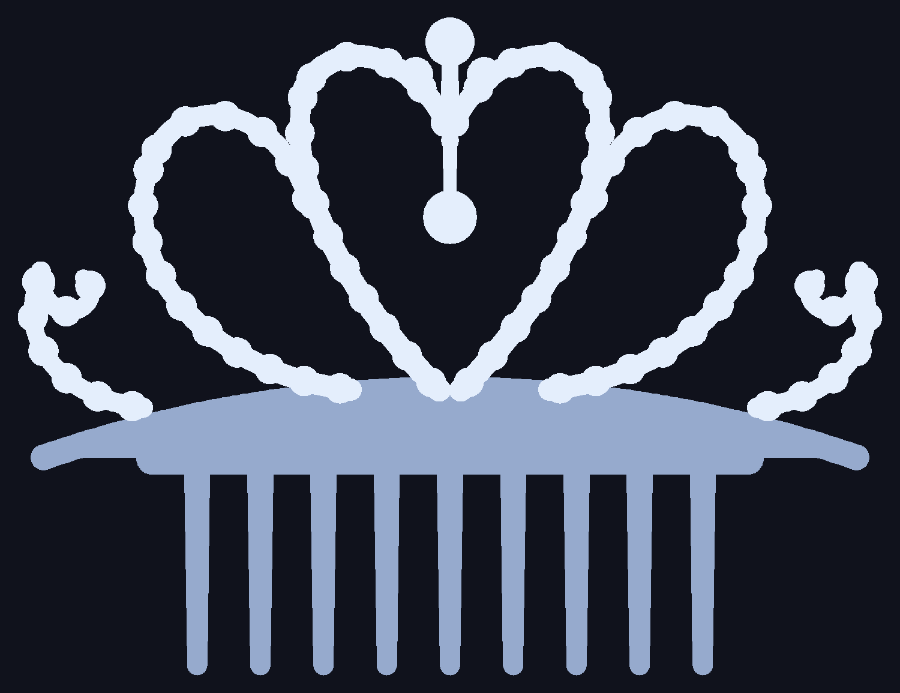

# Princess tiara comb

A rhinestone-style tiara on a hair comb, drawn from the reference photos and
built to print in one piece.





**`tiara_comb_96mm.stl`** — 95.5 mm wide × 72.7 mm tall × 4.2 mm deep, watertight,
one body, about 7 g of filament.

## Printing

Face up, flat back on the bed, exactly as exported. **No supports.** The whole
piece is a height field over a flat base — every surface either rises straight
off the bed or curves over the top — and the build checks that, rather than
assuming it: all of the steep down-facing area is the flat back itself.

* 0.15–0.2 mm layers. A **brim** is worth it: the scrollwork touches the bed as a
  lot of separate thin strands.
* **PETG or PLA+ rather than plain PLA.** The teeth are 2.6 mm thick and 23 mm
  long; brittle PLA can snap one if it is forced into thick hair. Printed flat
  like this the layers run the strong way across a tooth, which is the main thing.
* Nothing is fine: strands are 2.2–2.6 mm wide and round over to a 2.6 mm
  section, stones stand 1.6–3 mm proud, teeth are 2.9 mm at the root.

**It prints flat, and heads are not.** To curve it, dip the band and comb in
water at about 70 °C for twenty seconds and bend gently over something round —
PLA and PETG both soften enough to take a set and hold it once cool. Do this
before painting.

Silver or chrome filament reads best. The stones are domed, so a dab of clear
gloss or coloured nail polish on each one gives a convincing sparkle; they are
raised, not sockets, so there is nowhere to glue a real rhinestone in.

## The design

Matching the references: a crescent band with a 9-tooth comb below it, and above
it a beaded crown — a central heart carrying a crowning stone on a stem and a
hanging drop, two scroll loops sweeping out and curling back onto the heart, and
a tight curl at each end.

Every strand is stroked with a round pen along a Bézier or a spiral, and stones
are set at even intervals along the path. Unioning strokes can only *add*
material, so the narrowest pen a design asks for is a hard floor on its feature
size — the same trick as the snowflakes in this repo.

The third dimension comes from a height field rather than a flat extrusion:
strands roll over to their own half width so they come out round like wire, the
crescent gets a gentler roll so it reads as polished metal, each stone is a
hemisphere of the radius it was drawn with, and the comb stays a flat section
because teeth want their full thickness.

```bash
pip install numpy shapely trimesh scikit-image pillow
python3 tiara.py --scale 0.85 --out smaller.stl     # 81 mm wide
python3 preview.py                                  # flat drawing, to check the art
```

`--scale` resizes the drawing only — thicknesses stay in millimetres, since they
are set by what the printer can do rather than by how big the tiara is. The run
reports the narrowest wall and refuses anything under 1.4 mm, so scaling down too
far fails rather than printing as lace.

Files: `curves.py` (Bézier, arc, spiral, stroking, bead spacing), `design.py`
(the tiara itself, all coordinates in one place), `tiara.py` (height field,
marching cubes, checks), `preview.py` (flat PNG).

Renders were made with the previewer from the sibling `highland-cow/` project.
