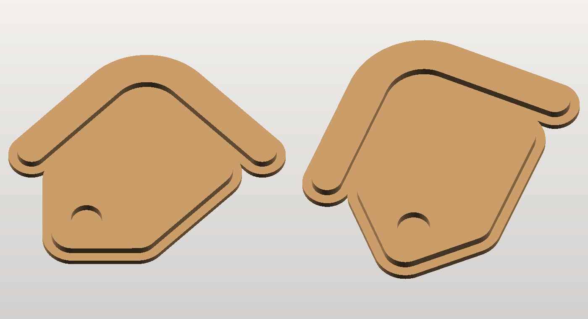

# UK Property Looker badge — printable

The badge mark from the logo (no wordmark), extruded into a solid you can print.



## Why there are two files

The mark is **two disconnected shapes**: a roof chevron floating above a rounded
tag, with a 5.5 mm gap between them at this size. So it cannot print as one
piece on its own — hence a choice:

| File | | |
|---|---|---|
| **`ukpl_badge_plaque_100mm.stl`** | 106.8 × 93.5 × 6 mm, one piece | the mark raised 3.5 mm on a 2.5 mm backing plate that follows its outline. Print-and-display ready. |
| `ukpl_badge_flat_100mm.stl` | 100 × 86.7 × 6 mm, two pieces | the bare mark, roof and tag as separate solids in true relative position. For gluing onto something, insetting, or printing the two parts in different colours. |

<p align="center">
   
</p>

On the plaque the tag's eyelet becomes a 3.5 mm recess rather than a hole, and
the gap between roof and tag becomes a recessed channel — the plate reads as the
logo's own outline rather than as a rectangle stuck behind it.

## Printing

Lay it flat, back down, logo up — that is how both files are already oriented.
**No supports, no raft**, nothing overhangs; every wall is vertical.

* 0.2 mm layers, 3 perimeters, 15 % infill → about 21 g of PLA (plaque).
* Thinnest feature is 10 mm wide, so nozzle size is irrelevant here.
* **Two-tone trick:** on the plaque the plate ends and the mark begins at exactly
  Z = 2.50 mm. Insert a filament change (`M600`, or your slicer's colour-change
  at height) there and the mark comes out in a second colour — the brand blue on
  white reads very close to the real logo.
* The back is flat and smooth: double-sided tape or 3M command strips will hold
  it on a wall. No hanging hole is modelled — say the word and I will add a
  keyhole slot.

## Rebuilding at another size

```bash
pip install numpy shapely trimesh mapbox_earcut manifold3d pillow
python3 badge.py --width 150 --out big.stl --preview big.png
```

| Flag | |
|---|---|
| `--width 100` | width of the *mark* in mm (the plaque comes out a little wider) |
| `--style plaque \| flat` | which of the two above |
| `--thickness 6` / `--plate 2.5` | total height, and how much of it is the backing plate |
| `--border` | how far the plate oversails the mark. Defaults to whatever fuses the two shapes plus a margin, so it scales with `--width`; pass a value to override and the script tells you the minimum if it is too small |
| `--svg badge.svg` | any other single-colour SVG — this is not badge-specific |
| `--preview x.png` | flat top-down PNG, to check the outline against the source art |

Every run prints its own checks: watertight, body count, and the fraction of the
artwork sitting in walls thinner than 1.5 mm. It exits non-zero if any fail.

## How it works

* `svgpath.py` — a small SVG path reader: tokenises the `d` attribute (including
  nasties like `71.29.03` meaning two numbers) and flattens curves to polylines.
* `shapes.py` — turns the rings into shapely geometry using SVG's **non-zero**
  fill rule, worked out from the containment tree and each ring's winding. That
  is what correctly makes the tag's eyelet a hole while keeping the roof — which
  winds the other way but sits outside the tag — a solid.
* `badge.py` — scales to millimetres, flips SVG's y-down axis, simplifies away
  the points a printer cannot resolve, extrudes, and unions plate to mark.

`badge.svg` is the mark lifted from the site's icon sprite
(`symbol#ukpl-logo-badge`), cropped to its own bounding box and otherwise
untouched — the printed outline is the logo's own geometry, not a redraw.

The 3D render above was made with the previewer from the sibling
`highland-cow/` project: `python3 ../highland-cow/render.py file.stl out.png --flat`.
