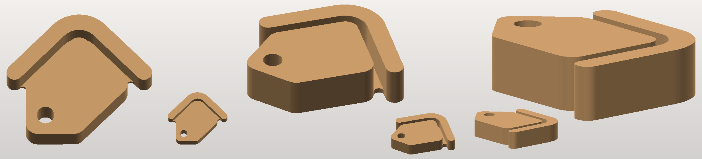

# UK Property Looker badge — printable

The badge mark from the logo (no wordmark), as printable solids.



## The files

| File | | |
|---|---|---|
| **`ukpl_badge_block_110mm.stl`** | 110 × 95.3 × 26 mm, one piece | the mark extruded thick with **square edges — no bevel anywhere**. The roof is held on by a thin web across the shadow gap, and nothing else. |
| `ukpl_badge_keyring_45mm.stl` | 45 × 39 × 8 mm, one piece | the same block at keyring size: 10 g, with a 5.4 mm bore for a split ring. |
| `ukpl_badge_plaque_100mm.stl` | 106.8 × 93.5 × 6 mm, one piece | flat version: the mark raised 3.5 mm on a backing plate that follows its outline. |
| `ukpl_badge_flat_100mm.stl` | 100 × 86.7 × 6 mm, two pieces | the bare mark as two solids in true relative position, for gluing onto something or insetting. |

<p align="center">
   
</p>

**The tag's eyelet is a real through-hole**, straight-sided, right through the
full thickness — 13.2 mm on the 110 mm block, 5.4 mm on the keyring. It scales
with the art, so a split ring wants the smaller one: at 110 mm the block is
72–183 g, which is a desk object, not something for a pocket.

The mark is **two disconnected shapes** — a roof chevron floating above a rounded
tag — so something has to join them. The block does it with a **3.5 mm web**
across the gap and nothing more: no plate, no plinth. The web sits against the
**back** face, so from the front the gap reads as a 22.5 mm-deep blind slot with
the silhouette intact, and the block lies flat on its back with nothing
overhanging.

## Printing the block

Flat on its back, as exported — logo face up. **No supports:** measured, not
assumed, there is 0.00 mm² of down-facing surface anywhere but the bed.

Putting the web mid-depth instead would look symmetric from both sides, but it
leaves 665 mm² of web hanging in mid-air. Standing the block on its own bottom
edge puts 6,311 mm² over thin air — and at 26 mm deep it will not stand up
unaided anyway: the centre of mass sits 46 mm up and 0.2 mm *outside* the
28 × 26 mm contact patch. Lying flat is the one orientation that needs no
support, which is why it is exported that way.

* 0.2 mm layers; about 72 g of PLA at 15 % infill (183 g if you print it solid).
* Every wall is square and vertical, so perimeters stay simple and the edges come
  out crisp.
* The exact geometry is extruded and booleaned rather than sampled on a grid, so
  the edges are truly sharp — a voxel mesher rounds them by half a voxel — and
  the file is 111 kB and 2,226 triangles.

```bash
pip install numpy shapely trimesh mapbox_earcut manifold3d pillow
python3 badge.py --style block --width 130 --thickness 30 --out bigger.stl
python3 badge.py --style block --width 45 --thickness 8 --web 2.5 --out keyring.stl
```

`--thickness` sets how deep the block is and `--web` how thick the bridging web
is. `--reach` — how wide a gap the web closes — defaults to a value worked out
from the artwork, because the gap scales with `--width` while a millimetre value
would not: left fixed, it silently stops bridging on a smaller badge. Every run reports size, watertightness, body
count and the fraction of the artwork in walls too thin to print, and exits
non-zero if any fail.

## The sculpted variant

`stand.py` is the other approach: the mark rolled over to a bullnose edge with
gently domed faces, standing on a plinth, meshed from a distance field. Not what
the block is for, but the flags are there — `--edge`, `--dome`, `--base none`,
`--web-centred` — if a softer object is ever wanted.

```bash
python3 stand.py --out sculpted.stl
```

## How it works

* `svgpath.py` — a small SVG path reader: tokenises the `d` attribute (including
  nasties like `71.29.03` meaning two numbers) and flattens curves to polylines.
* `shapes.py` — rings to shapely geometry under SVG's **non-zero** fill rule,
  worked out from the containment tree and each ring's winding. That is what
  correctly makes the tag's eyelet a hole while keeping the roof — which winds
  the other way but sits outside the tag — a solid. Also builds the bridging web,
  as a morphological closing of the mark: it fills the shadow gap and leaves the
  silhouette alone.
* `badge.py` — the three extruded styles, with the printability checks.
* `stand.py` — the distance-field route, for the sculpted variant.

`badge.svg` is the mark lifted from the site's icon sprite
(`symbol#ukpl-logo-badge`), cropped to its own bounding box and otherwise
untouched — the printed outline is the logo's own geometry, not a redraw.

Renders were made with the previewer from the sibling `highland-cow/` project:
`python3 ../highland-cow/render.py file.stl out.png --flat`.
