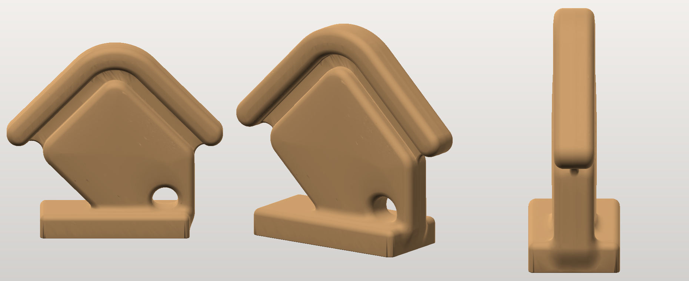

# UK Property Looker badge — printable

The badge mark from the logo (no wordmark), as printable solids.



## The files

| File | | |
|---|---|---|
| **`ukpl_badge_stand_110mm.stl`** | 110 × 36 × 97 mm, one piece | the mark as a solid object standing on a plinth: 15 mm deep, gently domed faces, a 3.2 mm bullnose all round, the eyelet a real hole you can see through. A desk piece. |
| `ukpl_badge_plaque_100mm.stl` | 106.8 × 93.5 × 6 mm, one piece | flat version: the mark raised 3.5 mm on a backing plate that follows its outline. Lies flat, or hangs on a wall. |
| `ukpl_badge_flat_100mm.stl` | 100 × 86.7 × 6 mm, two pieces | the bare mark, roof and tag as separate solids in true relative position, for gluing onto something or insetting. |

<p align="center">
   
</p>

The mark is **two disconnected shapes** — a roof chevron floating above a rounded
tag — so something has to join them. The flat files answer that with a backing
plate; the standing piece answers it with a **recessed web**: a 3.5 mm membrane,
centred in the 15 mm depth, that fills the shadow gap between roof and tag. From
the front the gap still reads as a deep channel; structurally the roof is held,
and while printing it gives the roof something to grow from.

## Printing the standing piece

Base down, as exported — 0.2 mm layers, 3 walls, 15 % infill, about 53 g of PLA.

**It needs light supports.** 274 mm² of material starts in mid-air, all of it
between z = 22 and 86 mm, worst at z = 45 mm where the two roof tips begin
— they are the outermost points of the mark, with nothing beneath them. Tree
supports set to *touch the build plate only* will pick up those two spots and
little else. The rest of the down-facing surface is bullnose curve, which
self-supports and needs nothing.

It stands on its own: the centre of mass is 18 mm inside the 76 × 36 mm
footprint and 39 mm up, so it takes about 25° of tilt before it goes over.

The flat files still need no supports at all; the plaque's plate/mark boundary
sits at exactly Z = 2.50 mm, so a filament change there gives a two-tone badge.

## Rebuilding

```bash
pip install numpy shapely trimesh mapbox_earcut manifold3d scikit-image pillow
python3 stand.py --width 130 --out bigger.stl      # the standing piece
python3 badge.py --width 150 --style plaque        # the flat ones
```

`stand.py` flags worth knowing: `--depth` (how deep the mark is), `--dome` (how
much the faces swell toward the middle — 0 gives flat extruded faces, 3 looks
inflated), `--edge` (bullnose radius), `--web` / `--web-reach` (the bridging
membrane), `--base W,D,H` and `--embed` (the plinth and how far the mark sinks
into it), `--voxel` and `--decimate` (mesh resolution and size).

Both scripts print their own checks and exit non-zero on failure: watertight,
single body, centre of mass inside the footprint, unsupported area per layer,
and how much of the artwork sits in walls too thin to print.

## How it works

* `svgpath.py` — a small SVG path reader: tokenises the `d` attribute (including
  nasties like `71.29.03` meaning two numbers) and flattens curves to polylines.
* `shapes.py` — rings to shapely geometry under SVG's **non-zero** fill rule,
  worked out from the containment tree and each ring's winding. That is what
  correctly makes the tag's eyelet a hole while keeping the roof — which winds
  the other way but sits outside the tag — a solid.
* `badge.py` — the flat versions: scale, extrude, union plate to mark.
* `stand.py` — the standing one. It measures an exact 2D signed distance to the
  mark, then builds a 3D field from it: erode by the bullnose radius, extrude,
  offset back out, and let the half-depth swell toward the interior for the
  dome. The web comes from a **morphological closing** of the mark, which fills
  the shadow gap and nothing else, with the holes put back so the eyelet
  survives. A rounded box blends in underneath as the plinth, and marching cubes
  meshes the lot — which is what buys the fillet where the mark meets its base
  instead of a seam.

`badge.svg` is the mark lifted from the site's icon sprite
(`symbol#ukpl-logo-badge`), cropped to its own bounding box and otherwise
untouched — the printed outline is the logo's own geometry, not a redraw.

Renders above were made with the previewer from the sibling `highland-cow/`
project: `python3 ../highland-cow/render.py file.stl out.png` (add `--flat` for
faceted parts like the plaque).
